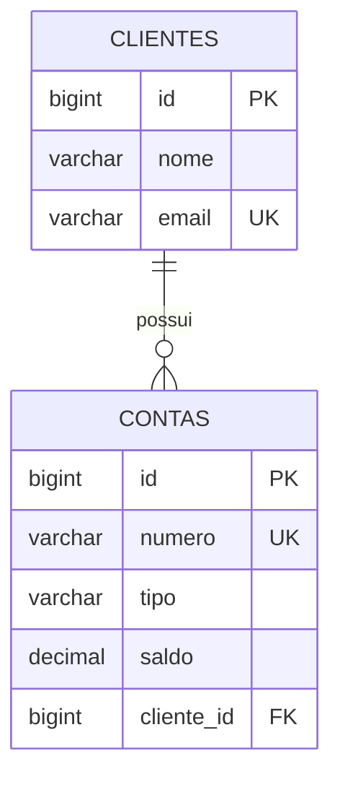

# DimDim — backend do Checkpoint 2

API REST independente para cadastro de clientes e contas bancárias, criada para o checkpoint de **DevOps Tools & Cloud Computing — Aplicativos e Banco em Nuvem** da FIAP. Este projeto começa do zero e não reutiliza a Sprint 3.

## Escopo desta etapa

Backend Java 17 / Spring Boot 3.5.6, Maven, Spring Data JPA, Bean Validation, driver Microsoft SQL Server e Actuator. Duas tabelas relacionadas, CRUD em ambas, DDL e coleção Postman incluídos. O saldo é um campo cadastral de demonstração: não há transferências, depósitos ou processamento financeiro real.

**Ainda falta para a entrega completa:** provisionamento e deploy automatizado por Azure CLI, configuração e comprovação do Application Insights, testes no Azure SQL, vídeo, links no GitHub e PDF dos integrantes. O frontend é opcional e pode render o ponto adicional descrito pelo professor. Os testes locais são preparação; a demonstração final deve acontecer na nuvem.

## Organização

```text
src/main/java/br/com/fiap/dimdim/  API, DTOs, entidades, serviço e repositórios
src/main/resources/              configuração do Azure SQL
src/test/                       testes de integração e H2 exclusivo dos testes
scripts/ddl.sql                 DDL para Azure SQL Database
scripts/verificar-persistencia.sql consultas para evidenciar cada operação
postman/                        JSON das operações GET, POST, PUT e DELETE
```

Fluxo do backend: Controller → serviço transacional → repositório JPA → banco. As respostas usam DTOs para não serializar as entidades e os vínculos diretamente.

## Modelo de dados



Um cliente pode ter várias contas. Uma conta pertence a um cliente. E-mails são normalizados para minúsculas. Conta exige número de 4 a 20 dígitos, tipo `CORRENTE` ou `POUPANCA`, saldo não negativo com até duas casas decimais e cliente existente. Não é permitido excluir cliente com contas: primeiro exclua as contas. PUT substitui todos os campos editáveis e permite mudar o cliente da conta.

## Testar sem credenciais de nuvem

Pré-requisitos: JDK 17 e Maven 3.6.3 ou superior (recomendado 3.9.x).

```bash
mvn clean verify
```

Validação executada: `mvn verify` concluído com sucesso; quatro testes de integração, zero falhas e zero erros; JAR executável gerado. A integração com Azure SQL ainda não foi executada.

Os testes iniciam Spring Boot com MockMvc e H2 no perfil `test`, disponível somente em `src/test`. Verificam CRUD completo, persistência, relacionamento, exclusão bloqueada, duplicidades e rollback, referências inexistentes, JSON inválido, validação e reatribuição de conta. H2 não substitui a validação no Azure SQL.

## Executar com Azure SQL Database

1. Tenha um servidor lógico SQL e um Azure SQL Database. Configure acesso de rede ao banco para o ambiente que executará a aplicação.
2. No editor SQL conectado ao banco correto, execute `scripts/ddl.sql` uma vez. A aplicação usa `ddl-auto: validate`: valida o esquema e não cria/apaga tabelas automaticamente.
3. Configure as variáveis de ambiente. **Não publique valores reais nem grave credenciais no repositório.** `.env.example` é um modelo: Spring Boot não importa `.env` automaticamente.

Linux/macOS:

```bash
export DB_URL='jdbc:sqlserver://SEU_SERVIDOR.database.windows.net:1433;databaseName=SEU_BANCO;encrypt=true;trustServerCertificate=false;loginTimeout=30;'
read -r -p 'Usuário SQL: ' DB_USERNAME
export DB_USERNAME
read -r -s -p 'Senha SQL: ' DB_PASSWORD
export DB_PASSWORD
mvn clean package
java -jar target/dimdim-backend.jar
```

PowerShell:

```powershell
$env:DB_URL = 'jdbc:sqlserver://SEU_SERVIDOR.database.windows.net:1433;databaseName=SEU_BANCO;encrypt=true;trustServerCertificate=false;loginTimeout=30;'
$cred = Get-Credential -Message 'Credenciais do Azure SQL'
$env:DB_USERNAME = $cred.UserName
$env:DB_PASSWORD = $cred.GetNetworkCredential().Password
mvn clean package
java -jar target/dimdim-backend.jar
```

Configurações opcionais: `SERVER_PORT` (padrão 8080). `/actuator/health` verifica também a conexão com o banco, sem divulgar os detalhes. A conexão JDBC exige criptografia e valida o certificado do servidor.

No futuro App Service, configure `DB_URL`, `DB_USERNAME` e `DB_PASSWORD` nas variáveis do aplicativo. O JAR é `target/dimdim-backend.jar`. Não use o perfil de testes no deploy.

## Operações REST

| Método | Clientes | Contas | Resultado |
|---|---|---|---|
| POST | `/api/clientes` | `/api/contas` | 201 + Location + registro |
| GET | `/api/clientes` | `/api/contas` | 200 + página de registros |
| GET | `/api/clientes/{id}` | `/api/contas/{id}` | 200 + registro |
| PUT | `/api/clientes/{id}` | `/api/contas/{id}` | 200 + registro atualizado |
| DELETE | `/api/clientes/{id}` | `/api/contas/{id}` | 204 sem corpo |

Listagem paginada: `?page=0&size=20&sort=id,asc` (máximo 100 por página). A lista fica no campo `content`. Não há corpo em GET e DELETE.

Cliente — POST/PUT:

```json
{"nome":"Pedro Demo","email":"pedro@example.com"}
```

Conta — POST/PUT (use o ID devolvido ao criar o cliente):

```json
{"numero":"10001","tipo":"CORRENTE","saldo":100.00,"clienteId":1}
```

Conta — resposta:

```json
{"id":1,"numero":"10001","tipo":"CORRENTE","saldo":100.00,"clienteId":1}
```

Erros em formato Problem Detail: 400 para dados inválidos; 404 para registro/cliente vinculado inexistente; 409 para duplicidade ou exclusão com vínculo. Mensagens de validação aparecem em `campos`. Exemplo:

```json
{"type":"about:blank","title":"Conflict","status":409,"detail":"Exclua as contas vinculadas antes de excluir o cliente"}
```

## Testar no Postman e preparar as evidências

Importe `postman/DimDim.postman_collection.json`. `baseUrl` começa com `http://localhost:8080` e deverá ser alterada para `https://SEU_APP.azurewebsites.net` na demonstração. As requisições de criação salvam automaticamente `clienteId` e `contaId` nas variáveis da coleção.

A coleção está ordenada: criar/listar/buscar/atualizar cliente; criar/listar/buscar/atualizar conta; excluir conta; excluir cliente. Rode `scripts/verificar-persistencia.sql` no Azure SQL após **cada** operação, inclusive GET. Os dados são fictícios. Uma segunda execução exige que a anterior tenha excluído os registros, ou que se mudem os valores únicos.

## Próxima etapa: DevOps e monitoramento

A arquitetura alvo é Azure App Service (Java) conectado ao Azure SQL Database, com Application Insights coletando requisições, falhas e dependências JDBC. O Actuator não substitui o Application Insights. Nenhum agente foi instalado nem monitoramento ativado nesta etapa; isso será configurado junto ao deploy. Na etapa de nuvem, acrescentar os scripts CLI em `scripts/`, how-to completo de provisionamento/deploy, diagrama macro dos recursos e evidências reais. Não gravar parâmetros SQL contendo dados pessoais no vídeo ou nos logs.

O backend é uma demonstração acadêmica sem autenticação/autorização. Use apenas dados fictícios. Controle de acesso deve ser acrescentado antes de qualquer uso real com dados bancários.

## Referências técnicas

- [Spring Boot — requisitos](https://docs.spring.io/spring-boot/3.5/system-requirements.html)
- [Microsoft JDBC — conexão criptografada](https://learn.microsoft.com/en-us/sql/connect/jdbc/connecting-with-ssl-encryption)
- [Application Insights Java](https://learn.microsoft.com/en-us/azure/azure-monitor/app/java-in-process-agent)
